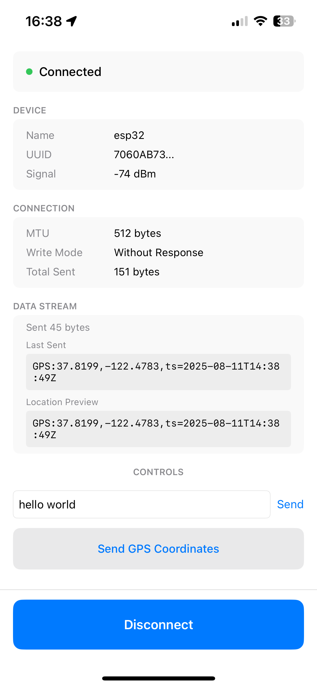

# esp_ble
Simple iOS snippet that transmits the iPhone location data to an ESP32 over Bluetooth Low Energy.

IMPORTANT NOTE: this is not a safe way to connect to a Bluetooth device. 

## UUID Configuration
Default UUIDs:
- Service: `0000FFFF-0000-1000-8000-00805F9B34FB`  
- Characteristic: `0000FF01-0000-1000-8000-00805F9B34FB`

To change UUIDs, update both:
- **iOS**: `Models.swift` → `BLEConfiguration` struct
- **ESP32**: `main.cpp` → `SERVICE_UUID` and `CHARACTERISTIC_UUID` defines

## Permissions Required
The following permissions must be enabled on the iOS device (see [`esp-ble-Info.plist`](esp-ble-Info.plist)):
- Bluetooth (device communication)
- Location When In Use (GPS coordinates)

## Requirements
- iOS 14.0+
